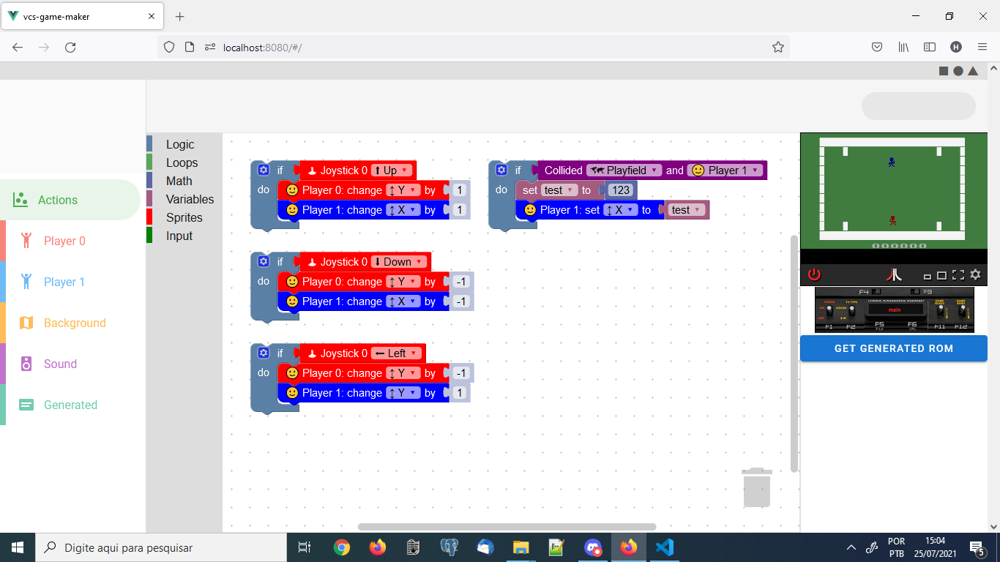

# vcs-game-maker

This online tool is a no-code environment designed to allow someone to create a game for Atari 2600 without knowing much about programming and without installing anything on their computer.

It uses [Blockly](https://developers.google.com/blockly) to allow the user to implement the logic using blocks and then, behind the scenes, generates a [Batari Basic](https://www.randomterrain.com/atari-2600-memories-batari-basic-commands.html) source code, that is then be compiled using [batari-basic-js](https://github.com/haroldo-ok/batari-basic-js) in order to generate an Atari 2600 ROM, which is emulated using [Javatari](https://javatari.org/).

*This is very much a work-in-progress.*




## Project setup
```
npm install
```

### Compiles and hot-reloads for development
```
npm run serve
```

### Compiles and minifies for production
```
npm run build
```

### Lints and fixes files
```
npm run lint
```

### Customize configuration
See [Configuration Reference](https://cli.vuejs.org/config/).
